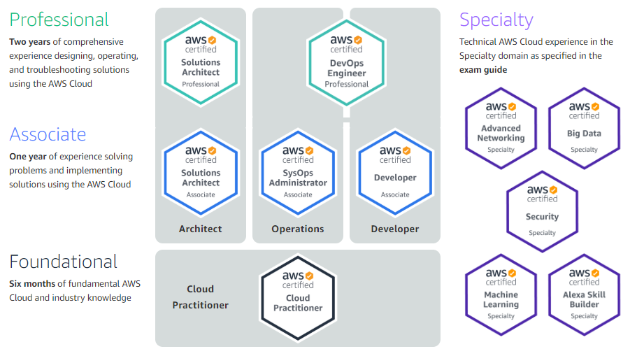

This is the first post of content for preparing yourself for becoming an AWS Solutions Architect Associate.

In this post, we are going to focus on Elastic Cloud Compute, EC2, on AWS.

As I have done previously let's look at the similarities and differences to the closest equivalent in Azure. EC2 is the Infrastructure as a Service (IaaS) compute service within AWS.  It is the same as Azure Virtual Machines.

AWS has similar pricing options as Azure:
- On-demand (Pay as you go)
- Reserved - 1 or 3 year capacity reservation - steady state and predictable performance.  AWS does have additional tiers to reservations, unlike Azure. 75% savings to on-demand.
    - Standard
    - Convertible
    - Scheduled
- Spot instances - similar to using a B-series VM on Azure.  Use of excess capacity on AWS.  AWS allows you to bid on the pricing, but not reliable but good for dev environments.  Used with flexible applications and do not need to stay on. Price fluctuates hourly on AWS.  Spot blocks can be set to avoid instances from being stopped when the price increases.  Can be set to 1-6 hours. 90% savings to on-demand.
    - Spot Fleet is a combination of Spot instances and On-demand instances. Spot Fleet will launch the number of instances to meet the target capacity with price restraints that you set.
- Dedicated host to use for mission critical workloads that require isolated resources for regulatory and for licensing requirements. On-demand or reserved.

EC2 instances have families of instances similar to Azure.  T3 is the lowest cost general purpose EC2 family.  M5 are general purpose typically used for Application servers. Full list can be found at this link: <https://aws.amazon.com/ec2/instance-types/>.

Subnet availability zones for EC2 assignments are randomly assigned and may be different from one instance to another, or you can choose manually.

Security group rules for VPC can be created when configuring an EC2 instance.

Reserved instances can be purchased within the console under instances.  This allows you to purchase the term and determine the upfront amount that you want to pay.  This is much more flexible to accomplish than within Azure.

**Encryption** - Defined when configuring the EC2 instance and can encrypt the root device volumes and EBS volumes during configuration.  Additional process to encrypt after the EC2 instance has been created.

When terminating (deleting) the EC2 instance, the default is that the root EBS volume is deleted and any additional EBS volumes remain unassigned, unless they are selected for deletion at termination.

EC2 root device EBS volumes can be encrypted at creation.  If you create the instance without encrypted volumes, you can create an encrypted snapshot and then launch the EC2 from the snapshot AMI. 

Only un-encrypted snapshots can be shared.

EC2 hibernate - saves the in-memory RAM to the EBS root volume to increase the time to resume the instance. Previous state is retained along with the instance ID. Hibernation needs to be enabled on the EC2 instance to use and root volume must be encrypted. Cannot be hibernated for more than 60 days.

**Security groups**

- Rule changes take affect immediately
Unlike Network Security Groups within Azure, there are no default inbound rules that are created.  
- You must explicitly create the allow rules, everything is **blocked inbound by default**.  Must enable individual ports.
- There is an outbound rule for all traffic.  These are stateful rules.
- Rules are all **ALLOW** within security groups.  Cannot block an individual port or IP address.  Network access control lists are used to block IP address traffic.
- EC2 instances can have multiple security groups attached.

I hope that you are enjoying this information so far.  It is helping me to continue to comprehend these services as I prepare for the exam myself.  Thank you very much.

**EC2 Placement groups**

**Three types**:
- Clustered - EC2 instances in the same single availability zone. Only certain instances can be placed in placement group.
- Spread - separated instances in different availability zones on isolated hardware from other instances. No instance on the same rack.
- Partitioned - each partition can have multiple instances with partitions separated on different racks.

Placement groups are similar to Azure Availability groups with update domains and fault domains to maintain uptime and availability of instances when there is a potential hardware or software failure within a data center or the data center racks.

**High Performance Compute (HPC) on AWS**

Ingesting and moving data into AWS:
- Snowball, Snowmobile
- AWS DataSync
- DirectConnect - private connection from on-premises to AWS

Compute and Networking:
- EC2 with GPU or CPU optimized
- EC2 fleets
- Placement groups
- Enhanced networking - single root I/O virtualization (SR-IOV) higher performance and less latency from traditional networking.  (ENA or legacy VF interface)
- Elastic network adapters - supports up to 100 Gbps
- Elastic fabric adapters - network device with higher throughput and lower latency.  Utilize OS bypass to communicate with the EFA device and not the kernal.

Storage services
- Instance attached storage
    - EBS
    - Instance storage
Network storage
    - S3
    - EFS
    - FSx for Luster

Orchestration and Automation
- AWS Batch - hundreds of thousands of jobs that span multiple EC2 instances.
- AWS ParallelCluster - HPC clusters on AWS. Automate creation of VPCs, subnets, and cluster types.

**AWS WAF**

- Web application firewall to monitor HTTP and HTTPs
    - CloudFront
    - Application Load Balancer
    - API Gateway

WAF views into the query string parameter and can allow or block the traffic.
- Allow all requests except specified
- Deny all requests excepts specified
- Count the requests that match specified properties (Passive)

Block IP addresses, country of origin, strings that match attacks, malicious SQL code or scripts (XSS).

**Reference links**:

What I've Learned about IAM on AWS

<https://captainhyperscaler.github.io/amazon-web-services/2022/03/20/aws-iam> 

What I've Learned about S3 on AWS

<https://captainhyperscaler.github.io/amazon-web-services/2022/03/20/aws-s3> 

What I've Learned about EC2 on AWS

<https://captainhyperscaler.github.io/amazon-web-services/2022/03/22/aws-ec2> 

What I've Learned about EBS on AWS

<https://captainhyperscaler.github.io/amazon-web-services/2022/03/22/aws-ebs> 

What I've Learned about Cloudwatch on AWS

<https://captainhyperscaler.github.io/amazon-web-services/2022/03/22/aws-cloudwatch>

What I've Learned about RDS on AWS

<https://captainhyperscaler.github.io/amazon-web-services/2022/03/22/aws-rds>

What I've Learned about Route 53 on AWS

What I've Learned about VPC on AWS

What I've Learned about HA on AWS

What I've Learned about Security on AWS

What I've Learned about Lambda and serverless on AWS

