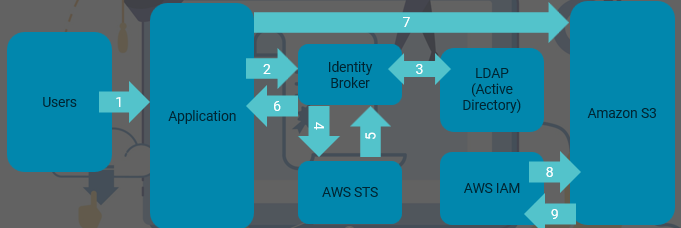
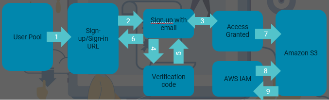

I provided an overview of AWS IAM from a configuration level in my blog series on the AWS Solution Architect Associate exam <https://captainhyperscaler.github.io/amazon-web-services/2022/03/20/aws-iam/>. 

I have been preparing for the AWS Security Specialty exam which takes a deeper dive into the creation and use of policies to manage permissions within AWS.  In this post, I will discuss some of these areas, starting with how IAM is used and why it is important.

**What is IAM?**

IAM is the acronym for Identity and Access Management.  Within cloud platforms, as we think about defense in depth, IAM becomes the first line of defense and responsibility for protecting resources, data, and personal information.  If we do not provide proper roles, policies, and permissions to users that are accessing resources within AWS, we have the potential to create a vulnerability that can be exposed and leveaged by an attacker.

The three main components to IAM are roles, policies, and permissions.
- Roles are create and assigned to resources for their level of required access.
- Policies define one or more permission that the role will have to access resources.
- Permissions are the allowed or denied levels of access that is allowed for that resource.

Resources are either a user or a service within AWS, such as a EC2 instance that needs access to a S3 bucket.

Within AWS, IAM is a global service.  It works across regions within the AWS account.

**Managing Root users**

When creating an AWS account, the Root user account is created.  Protection of this account extremely important.  The Root user account has full access and privileges to the entire AWS account and all of the resources.  The Root user account should only be used as an emergency access account and locked down otherwise.  

To protect the Root user account, you should immediately perform the following tasks:

- Change the password on the account (this should be done whenever a person with access to this account leaves the company).

- Activate MFA (if a user leaves with access, deactivate and reactivate MFA).

- Delete an Access Key IDs.  These provide programmatic access and should not be created within the Root account.

- Remove any key pairs for CloudFront, X.509 certificates, and any other account or resource identifiers that are within the Root account.

Users should be created with roles, policies, and permissions that enforce the principles of least privilege. Principle of least privilege is providing permissions to only the resources that a user requires to perform the duties required in their job description.

**IAM Policies**

IAM policies are used to assign the permissions to what a user or resource is allowed or denied access.  These are global policies that apply to all AWS resources within all regions.

There are three types of IAM policies:

- AWS Managed policies

- Customer Managed policies

- Inline policies

**AWS Managed policies** are standalone policies that are created and administered by AWS.  These policies are accessible and available within all AWS accounts and can be applied across AWS accounts.  For administrators that are new to AWS IAM, this is the best start to begin to assign users and groups policies to access and manage resources.

Examples of AWS Managed policies are:
- PowerUser: This is a user that has access to administer everything in the AWS account except for IAM.
- Administrator: This user has access to managed and view everything except billing within the AWS account.

**Customer Managed policies** are standalone policies that are created and administered by the customer.  These policies can be attached to multiple principal entities.  Unlike AWS Managed policies, these policies do not show up across AWS accounts, but the json of the policy could be copied and pasted into other accounts to recreate and use.

**Inline policies** are a one-to-one relationship between a policy and a specific principal entity.  These are strict and granular policies that are used to protect and govern access to a sensitive resource.  These policies are not reused across AWS accounts.

**Federated IAM in AWS**

AWS identity and access is not held to only those users and groups that are created within AWS.  AWS allows the capability to federate other identity providers through Security Token Services (STS) and Cognito.

STS provides limited and temporary access to AWS resources through the following identity services, or identity brokers:
- Federation which is typically with Windows Active Directory.  This capability uses the Active Directory credentials for the on-premises identities for access.  It can also be configured for SAML providers.  Federation provides Single Sign-on (SSO) for users without assigning IAM credentials in AWS.
- Federation with Mobile Apps provides a user to access through online identities such as Facebook, Amazon, Google or other OpenID provider credentials.
- Cross Account Access can be used by other AWS user accounts to access another AWS account.  An example is for partner organizations, such as a managed service provider that is assisting a company with managing their AWS account.

**How Federation works**

The key components and workflow to federation with STS is shown in the following diagram.  This includes the user or resource identity that is needing access to an application. When this request is made, the combination of joining one domain to the other is initiated through the identity broker.  The identity broker, also sometimes called the identity provider, is used to join company A to company B.  An identity store, such as Windows Active Directory, is used to maintain the user identities.

Next, we will look at how Cognito can be used to also provide access to AWS resources.

**AWS Cognito**

Cognito is another option to provide users with flexibility is access to AWS resources.  Cognito is a sign-up and sign-in functionality that would be used for a user to access an application that is built on AWS, such as a web application for e-commerce. 

To utilize Cognito, IAM administrators must create and configure a Cognito user pool that will be populated by the users that sign-up.  Within the user pool, you will add an App Client that will be used to generate the secret that a user will be provided on their temporary access to the web application.  We will create an OAuth flow and scope, and a can create a customized URL to access the application and required AWS resources.

The diagram below shows this workflow.  This is very similar to the STS Federation, but instead of having an identity broker and identity store, Cognito provides a verification code that is sent to the user's email address to sign-up and be provided access.  

Users are populated in the user pool for future access to the web application with their own email and created password.

Let's summarize AWS IAM and some recommended practices for protecting users and resources.

**Recommended Practices**

When planning, determining, and designing IAM in AWS or any platform, you should always utilize the principles of least privilege by providing users and groups the needed access to resources that are required to perform their job duties.  When possible, you should also provide elevated privileges to resources ONLY when necessary to perform a task rather than a user always having this level of access.

To protect resources and avoid compromised identities, zero trust principles should be utilized, denying access unless the user has been fully verified.  Utilizing multi-factor authentication (MFA) for all user accounts can assist in this practice.

When providing guest and external users access to resources, these accounts should only be given temporary and time-bound access that expire.  

Continuing the principle of zero trust, we should be  denying access to resources unless it is explicitly necessary to allow access.  AWS does this by default for access to most resources where policies must be put in place to allow access.  

Strict policies should be put in place to protect and govern access to resources.  This requires planning and identification of principals that require different levels of access.  

The IAM administrator should work with stakeholders in all departments to understand access levels that are required. To decrease administrative overhead, groups can be created and assigned proper roles, policies, and permissions based on departments and teams.

I hope that you have enjoyed this security overview of managing AWS IAM.

